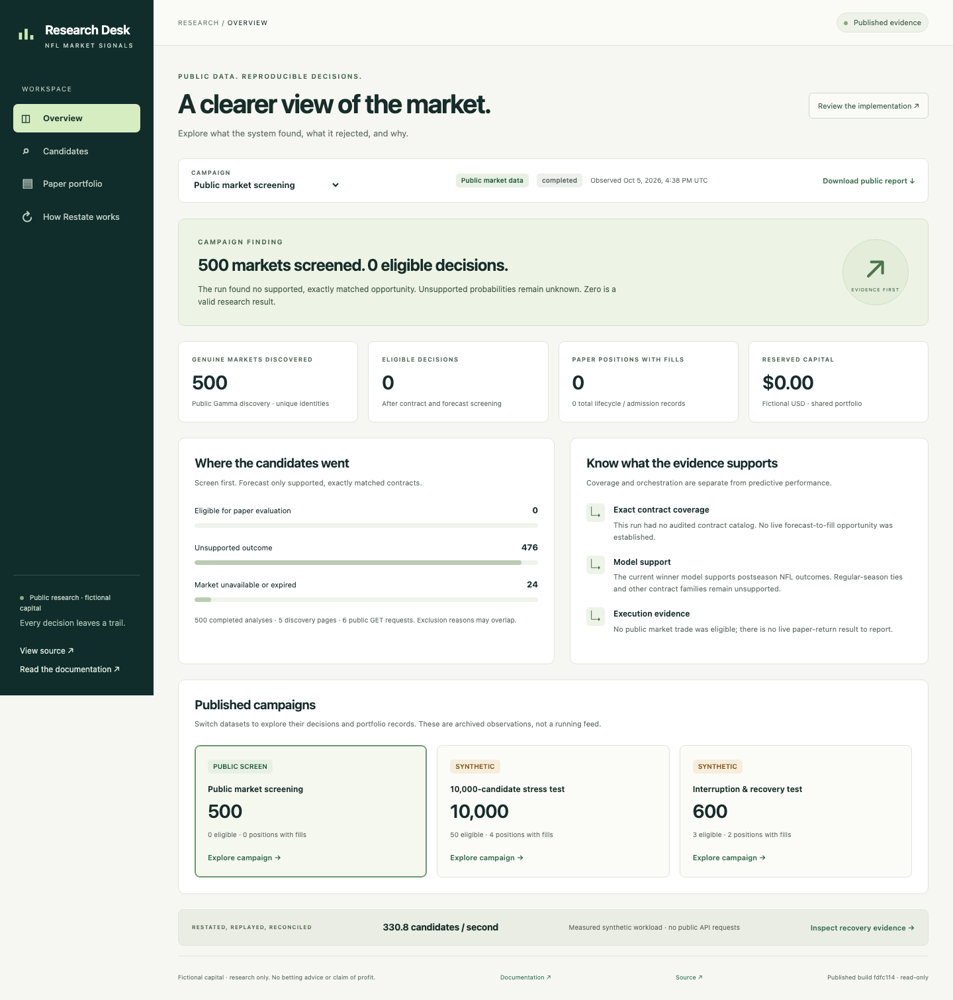

# Sports Gambling Research

A public research tool for discovering event contracts, evaluating reproducible NFL forecasts, and running bounded paper-trading campaigns with **fictional capital**. Restate preserves campaign and trade progress across worker/runtime interruptions; independent ledger transactions preserve accounting.

**[Open the hosted Research Desk](https://sudsampath.github.io/sports-gambling-research/)** · [How Restate works here](docs/restate-in-this-app.md) · [Execution policy](docs/paper-execution.md) · [Public data connector](docs/polymarket-data.md) · [Development workflow](DEVELOPMENT.md)

The public app is an interactive reader of reviewed campaign exports. It shows coverage, exclusions, candidate lineage, paper positions, settlement outcomes and actual recovery evidence. Campaigns run through the local Python CLI and a foreground Restate runtime. The hosted app does not run a market feed or expose portfolio controls.



## What the current evidence says

Observed on **2026-10-05**, with Restate Server **1.7.13** and Python SDK **1.0.5**:

| Run | Source | Evaluated | Eligible decisions | Paper positions with fills | Result |
| --- | --- | ---: | ---: | ---: | --- |
| Public screening | 500 genuine unique public markets | 500 | 0 | 0 | 476 unsupported outcomes; 24 unavailable/expired |
| Stress workload | Synthetic fixtures only | 10,000 | 50 | 4 | 30.23 seconds; 330.8 candidates/second; no public API requests |
| Interruption/recovery | Synthetic fixtures; actual process interruption | 600 | 3 | 2 | Lost acknowledgements reconciled; replay preserved balances; duplicate final settlement applied once |

An eligible decision can still be rejected by the risk gate or expire without a fill. Recovery produced three lifecycle records, including one zero-share cancellation. Fill counts include pending and settled positions with shares. The stress workload is separate from the public market count.

The live screening had **no audited contract catalog** and established no live forecast-to-fill opportunity. The current winner model supports exact **postseason NFL winner** contracts; regular-season ties and other outcomes remain unknown. Synthetic prices are deliberately favorable test inputs, and their model version is uncalibrated. Synthetic settlement uses a virtual future timestamp. These results demonstrate recoverability and accounting behavior, not profitability or predictive edge.

## Quickstart

Requirements: Python **3.11+**, Git, and Node **20+** for the web app. On this Mac the project uses Python 3.12. Public Polymarket screening requires no credentials or paid provider.

```sh
git clone https://github.com/SudSampath/sports-gambling-research.git
cd sports-gambling-research
# Check out the exact source commit identified by the hosted app:
# https://sudsampath.github.io/sports-gambling-research/build.json
git switch --detach <source_commit>
python3 -m venv .venv
.venv/bin/python -m pip install -e '.[dev]'
.venv/bin/python -m sgr.cli --help
```

On Windows, use `.venv\Scripts\python.exe` for research CLI commands; the native runtime bootstrap currently supports macOS/Linux. Keep `.env`, private keys, raw observations, SQLite/DuckDB databases and Restate state outside tracked files. The public Polymarket path never needs a wallet, signing key or account import.

### Browse the web app locally

```sh
cd web
npm ci
npm run build
npm run preview
```

Open **http://127.0.0.1:4173**. Stop the preview with Ctrl-C. The build validates the public schema and copies only explicit app files and manifest-listed JSON reports into `web/dist/`. It uses the project virtual environment; set `SGR_PYTHON` to another installed project Python if needed.

The four views provide:

- **Overview:** genuine/synthetic coverage, exclusion reasons, campaign comparison and measured throughput.
- **Candidates:** eligibility and text filters, pagination, known versus unknown probabilities, and a decision dialog with source/model/strategy/rule lineage and timestamps. Samples are disclosed: up to 100 eligible and 100 excluded decisions per campaign.
- **Paper portfolio:** fictional cash, reservations, available capital, lifecycle states, conservative fill assumptions, final settlement and separate marked estimates. Balances are shared-portfolio totals; displayed positions belong to the selected campaign.
- **How Restate works:** interactive service responsibilities, lost-acknowledgement recovery evidence, resource measurements, overhead and reproduction commands.

## Run a bounded public campaign

In terminal one, download the checksum-verified native runtime and start owned processes in the foreground:

```sh
.venv/bin/python scripts/bootstrap_restate.py
.venv/bin/python -m sgr.paper.runtime --seconds 120 --state .runs/restate-paper
```

In terminal two, from the same checkout:

```sh
.venv/bin/python -m sgr.cli campaign start --id public-screen \
  --candidates 500 --pages 5 --requests 20 --seconds 60 --wait
.venv/bin/python -m sgr.cli campaign status public-screen
.venv/bin/python -m sgr.cli campaign report public-screen \
  --out data/reports/public-screen.json
```

This default run discovers and classifies public contracts. Without audited contract definitions and suitable point-in-time sports observations, supported probabilities remain unknown and no paper position is admitted. Do not turn title similarity into an outcome mapping to increase coverage.

The runner stops its processes at its deadline or on Ctrl-C. It refuses occupied ports. Restart with the same `--state` and `--data` to recover. Default paper data is `data/polymarket`; canonical observations are under that root's `research/`. To reuse existing canonical `data/research`, use `SGR_PAPER_ROOT=data` in both terminals and the runner's `--data data`. See the [runtime and catalog guide](docs/restate-in-this-app.md) for audited spec files and exact matching requirements.

### Operate and inspect a campaign

```sh
.venv/bin/python -m sgr.cli campaign pause public-screen
.venv/bin/python -m sgr.cli campaign resume public-screen
.venv/bin/python -m sgr.cli campaign replay public-screen
.venv/bin/python -m sgr.cli campaign report public-screen
.venv/bin/python -m sgr.cli campaign settlements public-screen --pass-id pass-1
```

Status and reports work offline. Resume uses the serialized portfolio gate and reconciles before admission. Replay returns existing decisions and completion checkpoints; it does not refresh an expired analysis. A new observation/decision needs a new analysis identity. Settlement is a bounded pass over filled paper inventory using final public rules; it never submits or settles a real order.

Selected public WebSocket ingestion stays outside Restate:

```sh
.venv/bin/python -m sgr.cli campaign feed <canonical-market-id> --seconds 20
```

This archives relevant coherent books for an active binary contract, at most 30 seconds. Feed gaps and backwards timestamps invalidate freshness. Campaign maximums are 10,000 evaluations, 100 pages, 1,000 requests, 600 seconds, fan-out 16 and two rechecks. The request gate intentionally serializes HTTP admission; fan-out is not a claim of unlimited provider concurrency.

## How Restate is used

```mermaid
flowchart LR
    Public[Public connectors and selected feed] --> Snapshots[Coherent snapshots + canonical DuckDB history]
    Snapshots --> Scan[ScanCampaign: checkpoints and bounded batches]
    Scan --> Analysis[CandidateAnalysis: frozen lineage and forecast]
    Analysis --> Trade[PaperTrade: durable lifecycle and timers]
    Trade --> Risk[PaperPortfolio: serialized risk gate]
    Risk --> Ledger[Idempotent SQLite ledger]
    Ledger --> Reports[Reviewed public read models]
    Reports --> Web[Hosted Research Desk]
```



| Component | Meaningful durable responsibility | Independent safeguard |
| --- | --- | --- |
| `ScanCampaign` workflow | Pagination checkpoints, bounded analysis fan-out, partial completion, pause/rechecks and deadline timers | Frozen campaign policy and persistent catalog completion |
| `CandidateAnalysis` workflow | Frozen snapshot/input lineage and expensive forecasting | Exact settlement-rule matching and point-in-time feature cutoffs |
| `PaperTrade` workflow | Reservation, simulated submission, partial fills, expiry, reconciliation and settlement | Stable decision/fill/settlement keys and archived trade requests |
| `PaperPortfolio` keyed object | Serializes risk admission for one fictional portfolio | SQLite `BEGIN IMMEDIATE`, cap checks and accounting invariants |

External operations are journaled through `ctx.run_typed`; durable timers preserve decision intervals and lifecycle deadlines. Stable identities bind contract, observations, model, strategy and policy versions. The ledger is independently idempotent: when a simulated fill commits but its response is lost, recovery reads the existing fill before retrying. Restate does not replace market ingestion, model validation, DuckDB, or ledger transactions.

Completed trade workflow state and journals have 30-day retention. The immutable trade archive supports later settlement; portfolio effects continue to deduplicate independently. Keeping Restate state and SQLite/DuckDB storage together is essential. The [detailed Restate guide](docs/restate-in-this-app.md) covers operation boundaries, native bootstrap, interruption tests, retention and tradeoffs with code references.

## Research and execution integrity

The model foundation uses Pythagorean team strength from points scored/allowed, early-season prior shrinkage, log5 matchup probability and fitted home-field effects. Canonical schemas, DuckDB history, chronological calibration, backtesting, strategy plugins and bankroll functions are reused. Injuries affect forecasts only with independently corroborated OUT/INACTIVE availability known at the feature cutoff.

Models also provide win totals, expected margin and seeded season simulation for their supported outcomes. Turnover normalization and strength-of-schedule adjustments remain documented, unused baselines: earlier held-out comparisons did not improve the baseline. Trying several variants introduces strategy-selection/multiple-testing effects; a new untouched chronological holdout is required before claiming improvement.

Opportunity families are hypotheses:

- Cost-adjusted supported NFL forecasts against executable ask depth.
- Disagreement with de-vigged consensus or equivalent Kalshi outcomes, only with exactly matching definitions and point-in-time benchmarks. Automated consensus ingestion is still pending.
- Complementary/exhaustive pricing diagnostics after costs/depth/rules. Atomic multi-leg execution is unsupported; no guaranteed arbitrage claim.
- Injury/availability response diagnostics. Timestamped prospective book and injury history is still needed for a credible causal response study.

Every analysis records information cutoff, observation/availability times, input digest, source snapshots and model/calibration/strategy/rule versions. Ambiguous mappings, stale books, unknown fees, feed gaps and provider failures reject or pause admission. There are no LLM-derived probabilities.

The default versioned policy starts with fictional **$1,000**, a **$25** stake, and caps of **$50 per contract**, **$100 per event**, **$150 per correlated group**, **$400 total exposure**, and a **$100 realized-loss stop**. Fills cross displayed asks with fees, 500 ms latency and at most 25% of displayed depth. Unfilled reservations expire/cancel; filled inventory remains distinct from final or disputed settlement. Marks are unrealized estimates and can leave shares unpriced. The synthetic stress/recovery tests use shorter decision TTLs to exercise expiry.

Historical price series without historical order-book depth are not realistic execution backtests. Prospective public book collection, tie-aware regular-season validation and an untouched holdout remain the next research gates. See [paper execution](docs/paper-execution.md) and the [PRD](docs/PRD.md).

## Publish reviewed results

Detailed reports stay under ignored `data/`, `.research/` or `.runs/`. Public publication is an explicit projection, separate from raw reporting:

```sh
.venv/bin/python -m sgr.cli campaign export-public public-screen \
  public-screen-20261005 web/data/public-screen.json
.venv/bin/python scripts/validate_public_dashboard.py
```

`export-public` strips internal specs, raw source payloads/URLs, logs, local paths and arbitrary extra fields. It validates coverage, chronology, identities, probabilities and reconciled fictional accounting before replacing an output. Model and rule hashes remain for audit. Review the resulting public JSON and update `web/data/index.json` when adding a campaign. It does not perform live requests or start a workflow.

The shipped reports come from preserved local evidence. They are dated snapshots, not fresh quotes. [Publishing and schema details](docs/public-dashboard.md) explain refresh, reproducibility, data review and GitHub Pages deployment. Only the static build is hosted; Restate state, raw data and execution controls remain local.

## Validation and recovery

```sh
.venv/bin/python -m pytest tests/bdd
.venv/bin/python -m pytest
.venv/bin/python -m sgr.cli --help
git diff --check
cd web
npm test
npm run build
npx playwright install chromium
npm run test:browser
```

BDD covers process interruption, duplicate submission, lost fill acknowledgements, concurrent capital competition, partial fills, stale data, provider/feed failures, ambiguous rules, correlated exposure, look-ahead leakage, duplicates and replay accounting. Public-export scenarios additionally cover unknown probabilities, mixed source counts, private-field stripping and validation before file replacement. Browser scenarios run at desktop and 390-pixel mobile widths, including filters, dialog keyboard dismissal, lifecycle data, missing reports and body overflow.

Native runtime recovery tests are opt-in because they start temporary owned processes and include one bounded public screening session:

```sh
SGR_RUN_RESTATE_TESTS=1 .venv/bin/python -m pytest tests/bdd/test_restate_steps.py \
  -vv --basetemp .research/restate-delivery
```

Bootstrap the runtime first. Use an ignored `--basetemp` to retain raw evidence and journals for inspection. See the [recovery reproduction and measured resource usage guide](docs/restate-in-this-app.md).

## Repository map

| Location | Purpose |
| --- | --- |
| `src/sgr/connectors/` | Public Polymarket discovery/books/feed and existing sports/Kalshi provider boundaries |
| `src/sgr/research/` | Canonical schemas/history, exact matching, NFL models, calibration and point-in-time analysis |
| `src/sgr/paper/` | Campaign catalog, Restate workflows, risk ledger, reporting and runtime |
| `src/sgr/algorithms/`, `backtest/`, `risk/` | Existing strategy, evaluation and bankroll foundation |
| `web/` | Hosted read-only client, reviewed public read models and browser tests |
| `tests/features/`, `tests/bdd/` | Executable Given/When/Then behavior contracts |
| `docs/` | Research, connector, execution, Restate and hosting documentation |

Legacy demos remain available with `demo-value`, `demo-momentum`, and `demo-backtest`. The existing Kalshi connector is GET-only; authenticated demo requests require local key configuration in `.env.example` and a PEM outside the checkout. It is optional and unused by the public Polymarket workflow. Do not import private account data to reproduce these public campaigns.

## Assessment and contribution

Restate's primary success criterion here is **reliability**: recovering campaign progress and deadlines, coordinating child work, and preserving paper effects across retries. The interruption tests verified completed discovery/forecast reuse, stable replay accounting, and lost-ack recovery. Those observations support using Restate for this durable workflow.

It adds a worker, server, retained journals, memory use and operational coordination. Keeping high-frequency ingestion outside Restate limits that overhead. The evidence covers injected failures on one machine with persisted state. Sustained reliability rates, recovery latency, machine/storage-loss recovery and high-availability failover remain unmeasured; there is no comparative benchmark against another orchestration design.

Forecast quality and opportunity coverage are separate research evaluations. Their next gates are exact NFL contract coverage, prospective observations and an untouched holdout.

This repository contains no real-money order placement, wallet funding, signing or geographic bypass. Outputs are research signals, not betting or financial advice. Future real execution would require a separate approved proposal, including geographic eligibility rules; it is outside this tool.

Contributions follow [DEVELOPMENT.md](DEVELOPMENT.md): actionable Linear tickets, executable Given/When/Then scenarios, required checks, focused PRs and Claude Code review. Raw data and credentials are never publication artifacts.
