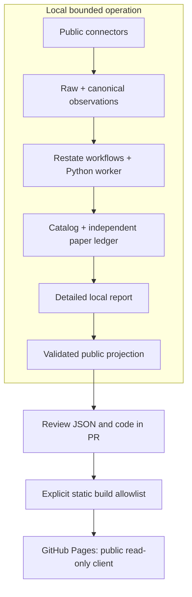

# Public Research Desk

The [hosted dashboard](https://sudsampath.github.io/sports-gambling-research/) lets public readers inspect published research evidence. It has no account, wallet, trading endpoint, browser storage or analytics. Views and campaign selection are shareable through query parameters. File and documentation links in a published build point to its source commit; repository and PR links point to their respective indexes.

## Hosting and execution boundary

GitHub Pages serves the static `web/dist/` build from `gh-pages`. No paid hosting or running market service is required. Python and Restate run locally, in explicitly bounded foreground sessions. Publishing the reader does **not** host Restate or enable remote campaign execution. [GitHub Pages supports static hosting rather than Python services](https://docs.github.com/en/pages/getting-started-with-github-pages/creating-a-github-pages-site).



Exposing campaign controls to public visitors would require a separately designed protected backend, authentication, storage/recovery operations and hosting access. Those are not silently inferred from publishing this reader.

## Public schema and privacy

The exporter is [public_report.py](../src/sgr/paper/public_report.py). `PublicCampaign` schema version 1 contains:

| Group | Published fields |
| --- | --- |
| Run | Public slug, source mode, status, scan start/finish and export timestamps, pages and request counts |
| Coverage | Completed/eligible counts, genuine unique markets, synthetic candidates, exclusion reasons, risk exclusions and audited-catalog availability |
| Decisions | Up to 100 eligible + 100 excluded records; contract/market/event/outcome-token/forecast/decision identities, supported probability or null, net edge/limit, decision/cutoff/expiry timestamps, versions, policy fingerprint and snapshot hashes |
| Portfolio | Up to 200 lifecycle rows, separate final settlements and conservative bid-depth marks; shared fictional cash/reserved/available/realized balances and reconciliation state |
| Policy | Version and fixed capital/exposure/loss/freshness/latency/depth assumptions |
| Audit | SHA-256 of the local source report, computed before projection |

Schema validation rejects contradictory policy fingerprints and timestamp ordering, mixed source counts, duplicate decisions, future feature cutoffs, probabilities from unknown models, contradictory sample coverage, unsafe labels and unreconciled accounting. Export additionally checks complete aggregate coverage against internal decision/error records before selecting the bounded public sample. Exclusion reasons may overlap. Errors without decisions remain aggregate exclusion counts; `candidate_total` counts available decision records. Positions, settlements and marked estimates each disclose their full totals and sample limits. Outcome references are checked against position IDs when the published position set is complete. The source-report hash is an audit reference, not a proof that the public reader can independently reconstruct private local evidence.

Raw source bodies, source URLs, account/configuration fields, portfolio IDs, internal specs, operation logs, local paths and arbitrary additional fields are not copied. Public version and reason identifiers use a limited character/length schema. Do not put sensitive data into an allowlisted identifier; review all public output before committing. Projection is a schema boundary, not a substitute for publication review.

`PublicEvidence` separately projects native-test observations: version pins, measured throughput/process-group RSS, operation attempt counts, replay/reconciliation flags and the disclosed synthetic virtual settlement time. It excludes the local evidence root and raw journal operations.

## Refresh reports

Operate a new bounded campaign as documented in the [README](../README.md). Then export while offline if desired:

```sh
.venv/bin/python -m sgr.cli campaign report <campaign-id> --out data/reports/local.json
.venv/bin/python -m sgr.cli campaign export-public <campaign-id> \
  public-screen-YYYYMMDD web/data/public-screen.json
.venv/bin/python scripts/validate_public_dashboard.py
```

The public slug is an explicit publication label, separate from the internal campaign/portfolio identifier. Validate before replacing the existing reviewed JSON. `exported_at` records export time; `started_at`/`scan_finished_at` describe the archived scan. Synthetic settlement timestamps are virtual and visibly labeled. None of these are a promise of current quote freshness.

Add or change manifest filenames in `web/data/index.json` deliberately. Only manifest-listed reports and `recovery-proof.json` are copied into the deployment. Never copy `.research/`, `data/` databases, Restate state or a raw report into `web/`.

The delivered 2026-10-05 exports were produced from the ignored evidence root with:

```sh
export SGR_PAPER_ROOT=.research/restate-delivery-20261005/native-paper0/evidence
.venv/bin/python -m sgr.cli campaign export-public live public-screen-20261005 web/data/public-screen.json
.venv/bin/python -m sgr.cli campaign export-public stress synthetic-stress-20261005 web/data/synthetic-stress.json
.venv/bin/python -m sgr.cli campaign export-public recovery synthetic-recovery-20261005 web/data/synthetic-recovery.json
.venv/bin/python scripts/export_dashboard_evidence.py \
  .research/restate-evidence.json web/data/recovery-proof.json
unset SGR_PAPER_ROOT
```

A new checkout includes these public projections, not the ignored raw evidence. New native test runs produce new observations/identities/timings; do not pretend they recreate live market data from the past. See [native recovery reproduction](restate-in-this-app.md).

## Build, review and publish

```sh
cd web
npm ci
npm test
npm run build
npx playwright install chromium
npm run test:browser
cd ..
.venv/bin/python -m pytest tests/bdd
.venv/bin/python -m pytest
.venv/bin/python -m sgr.cli --help
git diff --check
```

The web build uses no runtime JavaScript dependencies. Playwright is a pinned development dependency. Browser tests exercise both desktop and mobile, export loading failure, unknown probabilities, filters, dialogs, paper accounting and the Restate explainer. Screenshots and traces remain ignored locally; CI keeps them as short-lived review artifacts. [Playwright's configuration](https://playwright.dev/docs/test-configuration) documents the isolated browser and temporary server setup.

Follow the repository's Linear and Claude Code PR review process. After code/data review, commit the approved content, rebuild so metadata identifies that exact commit, and check publication artifacts:

```sh
cd web
npm run build
cd ..
.venv/bin/python scripts/publish_dashboard.py --source-commit <reviewed-HEAD-SHA>
# Once publication is authorized:
.venv/bin/python scripts/publish_dashboard.py --source-commit <reviewed-HEAD-SHA> --publish
```

The publisher requires a clean tracked tree, exact source commit, valid data, source/build byte agreement, an explicit artifact allowlist and admin access to this already-public repository. It also verifies that the source commit exists on GitHub before creating source links. It uses a temporary isolated worktree. It pushes a normal commit to `gh-pages`, refuses unrelated existing Pages content/configuration, never force-pushes, and configures Pages only if absent. Main and feature branches remain unchanged. The [official Pages API](https://docs.github.com/en/rest/pages/pages#create-a-github-pages-site) defines the branch publishing source.

Confirm the Pages build and public site after publication:

```sh
gh api repos/SudSampath/sports-gambling-research/pages
gh api repos/SudSampath/sports-gambling-research/pages/builds/latest
curl --fail https://sudsampath.github.io/sports-gambling-research/build.json
cd web
DASHBOARD_URL=https://sudsampath.github.io/sports-gambling-research/ npm run test:browser
```

Pages deployment may take several minutes. `build.json` records source commit, build time and content fingerprint. A future refresh uses the same checks and normal `gh-pages` history. It does not automatically schedule a feed or campaign.

## Current limits

The app is a public report reader with archived observations. It does not provide live prices, account data, recommendations or remote controls. The public screening produced zero eligible opportunities. Synthetic evidence proves lifecycle/recovery behavior, with deliberately engineered prices and virtual final outcomes. A realistic execution-return study still requires point-in-time book history, exact NFL coverage and an untouched chronological holdout.
